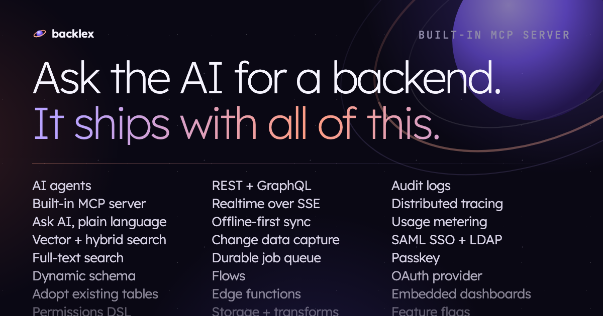
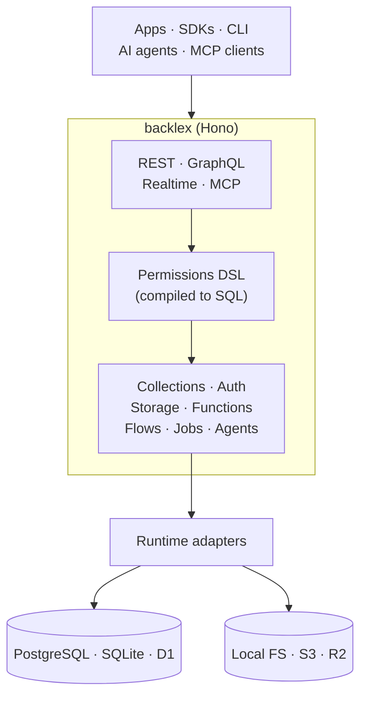

<div align="center">


# backlex

**The open-source, AI-native backend that runs anywhere.**

Describe your data in plain language or define it yourself — get REST, GraphQL,
realtime, auth, storage, functions and a built-in MCP server over your own
database, on Bun, Node, Deno, Cloudflare Workers, Vercel, Netlify, AWS Lambda,
Google Cloud or Azure.

[Website](https://backlex.com) ·
[Docs](https://backlex.com/docs) ·
[Live playground](https://play.backlex.com) ·
[Cloud](https://cloud.backlex.com) ·
[Examples](examples)

[](https://github.com/backlex/backlex/actions/workflows/test.yml)
[](LICENSE)
[](https://www.npmjs.com/package/backlex)



</div>

## Why backlex

- **Everything is in the open core.** SSO (SAML / LDAP), audit logs, row- and
  field-level permissions, backups, tracing — all Apache-2.0. There is no
  Enterprise tier to unlock them.
- **One codebase, every runtime.** The same Hono app self-hosts on Bun / Node /
  Deno and deploys to seven serverless and edge platforms, on PostgreSQL or
  SQLite / Cloudflare D1. The build matrix is checked on every push.
- **Your data model, live.** Create a collection and backlex runs `CREATE TABLE`
  against your database — no redeploy. Or point it at tables you already have
  and it wraps them without DDL.
- **AI that obeys your permissions.** Agents reach your data through the
  built-in MCP server, scoped by the same permissions DSL that filters REST,
  GraphQL and realtime — an MCP client never sees a row its key can't read.

An alternative to Supabase, Firebase, Directus, Appwrite, Strapi and AWS
Amplify — see the side-by-side comparisons:
[Supabase](https://backlex.com/vs-supabase) ·
[Firebase](https://backlex.com/vs-firebase) ·
[Directus](https://backlex.com/vs-directus) ·
[Appwrite](https://backlex.com/vs-appwrite) ·
[Strapi](https://backlex.com/vs-strapi) ·
[AWS Amplify](https://backlex.com/vs-aws-amplify).

## Features

**Data**
- [Dynamic schema](docs/index.md#your-first-collection), [schema templates](docs/templates.md), [snapshots, diff and branching](docs/schema-versions.md)
- [Adopt existing tables](docs/adopting-tables.md) or [import a database](docs/migrating-in.md) from Postgres, MySQL, SQLite, MongoDB, Firestore or DynamoDB
- Rich field types — [money](docs/money.md), [geo](docs/geo.md), [rollups](docs/rollups.md), [sequences](docs/sequences.md), [slugs](docs/slugs.md), [validation](docs/field-validation.md), [status transitions](docs/status-transitions.md)
- [Draft / publish](docs/draft-publish.md), revisions, [backup & restore](docs/backup-restore.md)

**APIs**
- [REST](docs/querying.md) with filter / sort / expand / projection, [GraphQL](docs/graphql.md) generated from the same metadata, OpenAPI 3.1
- [Realtime (SSE)](docs/realtime.md), [live queries](docs/reactive-queries.md), [offline-first sync](docs/offline-sync.md), [change data capture](docs/cdc.md)
- [Full-text](docs/full-text-search.md), [vector and hybrid search](docs/vector-search.md)

**Auth & security**
- Email, OAuth, magic link, OTP, passkey, 2FA, [SAML 2.0 and LDAP / AD](docs/sso.md)
- [Permissions DSL](docs/permissions.md) compiled to SQL — and to [Postgres RLS](docs/rls.md) if you want it in the database
- [Audit logs](docs/audit-logs.md), [GDPR erasure](docs/erasure.md), [OAuth provider](docs/oauth-provider.md), [organizations / teams](docs/app-organizations.md)

**Logic**
- [Sandboxed functions](docs/sandbox.md), visual [flows](docs/flows.md), [durable jobs](docs/jobs.md) with retry and dead-letter, cron
- [Webhooks](docs/webhooks.md), [integrations](docs/integrations.md), [payments sync](docs/payments.md), [approvals](docs/approvals.md)
- [Push](docs/push-messaging.md) and [SMS](docs/sms-messaging.md) messaging, [PDF documents](docs/documents.md), [e-signature](docs/e-signature.md)

**AI**
- [Built-in MCP server](docs/mcp.md) for Claude, Cursor and any MCP client
- [AI agents](docs/agents.md) with DSL-scoped tools and per-thread vector memory
- [Ask AI](docs/ask-ai.md) — type a question in the admin, review the tool call it proposes, run it

**Operate**
- Admin UI with grid, Kanban, gallery and calendar [views](docs/item-views.md)
- [Storage](docs/storage.md) with image transforms, [resumable uploads](docs/resumable-uploads.md), an [S3-compatible endpoint](docs/s3.md)
- [Feature flags](docs/feature-flags.md), [embedded dashboards](docs/embedded-dashboards.md), [forms](docs/forms.md), [tracing](docs/tracing.md), [usage metering](docs/usage-metering.md), [advisor](docs/advisor.md)

## Quick start

Try it without installing anything at **[play.backlex.com](https://play.backlex.com)**,
or run it locally (requires [Bun](https://bun.sh) ≥ 1.4):

```bash
git clone https://github.com/backlex/backlex && cd backlex
bun install
cp apps/web/.dev.vars.example apps/web/.dev.vars
bun run db:migrate:d1   # the dev server runs on miniflare, so it reads a local D1
bun run dev             # admin UI + API on http://localhost:5173
```

Open <http://localhost:5173/sign-up> — the first account becomes the admin.
Then follow [Getting started](docs/index.md) to create your first collection.

## Use it from your app

```bash
npm i backlex
```

```ts
import { createClient } from "backlex";

const backlex = createClient({ url: "https://api.your.app", workspace: "acme" });

await backlex.auth.signUp({ email, password, name });

await backlex.from("todos").create({ title: "Hello", done: false });
const { data } = await backlex.from("todos").list({ sort: ["-created_at"] });

const off = backlex.subscribe("items:todos", (e) => console.log(e.event, e.data));
```

Official SDKs for **TypeScript, Python, Go, Rust, Swift, Kotlin, Java, .NET,
Dart, Ruby and PHP** ([`sdks/`](sdks)), React bindings
([`docs/client-react.md`](docs/client-react.md)) and a CLI
(`npm i -g @backlex/cli`, [`docs/sdk-and-cli.md`](docs/sdk-and-cli.md)).

Connect an AI client to the same workspace — every tool call runs as the key
you give it:

```bash
curl https://your.app/mcp \
  -H 'Authorization: Bearer pak_…' -H 'Content-Type: application/json' \
  -d '{"jsonrpc":"2.0","id":1,"method":"tools/list"}'
```

Claude Desktop / Cursor configuration: [`docs/mcp.md`](docs/mcp.md).

## Deploy

[](https://vercel.com/new/clone?repository-url=https://github.com/backlex/backlex&env=APP_URL,AUTH_SECRET,DATABASE_URL,DATABASE_DRIVER,S3_BUCKET,S3_ACCESS_KEY_ID,S3_SECRET_ACCESS_KEY,CRON_SECRET&envDescription=Backlex%20runtime%20secrets%20(Postgres%2C%20S3%2C%20auth)&envLink=https://github.com/backlex/backlex/blob/main/docs/deployment.md)
[](https://app.netlify.com/start/deploy?repository=https://github.com/backlex/backlex)

| Target | Database | Guide |
|---|---|---|
| Bun / Node.js (self-host) | PostgreSQL, or SQLite (Bun) / libSQL (Node) | [Bun](docs/deployment.md#bun-self-host) · [Node.js](docs/deployment.md#nodejs-self-host-no-bun) |
| Deno / Deno Deploy | PostgreSQL, or libSQL (Deno) | [Deno](docs/deployment.md#deno-self-host-experimental) · [Deno Deploy](docs/deployment.md#deno-deploy-managed) |
| Cloudflare Workers | D1, or PostgreSQL via Hyperdrive | [Guide](docs/deployment.md#cloudflare-workers) |
| Vercel · Netlify | PostgreSQL | [Vercel](docs/deployment.md#vercel) · [Netlify](docs/deployment.md#netlify) |
| AWS Lambda · Google Cloud · Azure | PostgreSQL | [Lambda](docs/deployment.md#aws-lambda-serverless) · [Cloud Functions](docs/deployment.md#google-cloud-functions-2nd-gen) · [Azure](docs/deployment.md#azure-functions-v4) |

The database is picked from the environment — a `D1` binding, then
`DATABASE_URL`, otherwise a local SQLite file. Storage, realtime, image
transforms, email and the function sandbox each have per-runtime adapters —
see [Deployment](docs/deployment.md) for the environment variables and runtime
caveats.

Prefer not to run it yourself? [backlex Cloud](https://cloud.backlex.com) is the
same Apache-2.0 backlex, managed on Cloudflare's network — and exports as a
portable SQL dump whenever you want to leave.

## How it works



Every surface shares one permissions compiler: a role's condition becomes a SQL
filter for REST, GraphQL and MCP, and an in-memory predicate for realtime
events — same operators, same `$user` / `$tenant` variables. Runtime-specific code stays behind adapter
interfaces in `@backlex/core`; `apps/web/src/server/context.ts` picks the
implementations from bindings and env. More in
[Architecture](docs/architecture.md).

| Layer | Built on |
|---|---|
| API | [Hono](https://hono.dev) |
| Database | [Drizzle ORM](https://orm.drizzle.team) — PostgreSQL, SQLite, D1 |
| Auth | [better-auth](https://better-auth.com) |
| GraphQL | graphql-yoga |
| Admin UI | React, Vite, Tailwind CSS v4, shadcn/ui |

## Repository

```
apps/
  web/        API + admin SPA (one bundle)
  docs/       documentation site (Astro Starlight)
  site/       backlex.com
packages/
  core/       shared types + adapter contracts
  db/         dual-dialect schema, schema applier, permission compiler
  auth/       better-auth wrapper          auth-ui/   auth screens
  client/     TypeScript SDK (npm: backlex) cli/       backlex CLI
  ui/         design system                migrate/   database import
  integrations/  provider registry
sdks/         Python, Go, Rust, Swift, Kotlin, Java, .NET, Dart, Ruby, PHP
examples/     React, Next.js and React Router apps built on the SDK
docs/         guides (served at backlex.com/docs)
```

## Contributing

```bash
bun run dev         # admin + API with hot reload
bun run test        # test suite (fresh SQLite per spec, no external services)
bun run typecheck
bun run lint
```

Issues and pull requests are welcome. Start with
[Architecture](docs/architecture.md) and [Testing](docs/testing.md); the
[`examples/`](examples) apps are the quickest way to see a change end to end.

Found a vulnerability? Please report it privately — see [SECURITY.md](SECURITY.md).

## License

[Apache-2.0](LICENSE). Third-party notices: [THIRD-PARTY-LICENSES.md](THIRD-PARTY-LICENSES.md).
